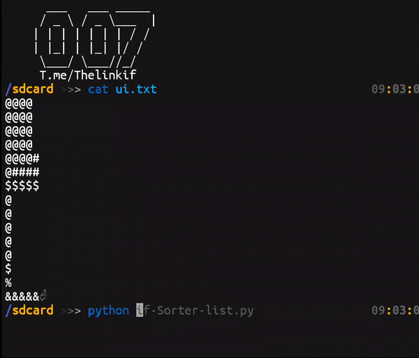

<h1>if Sorter list</h1>
 

 
<h2><a href="https://ifcompany.ir/apps/Python/Programs/if-Sort/index.html">link if</a></h2>
 
    Sorting for text lists
 
<h1>Prerequisites</h1>
<pre>
<code>$ apt update  
$ apt install git python -y</code>
</pre>
 
<h1>Run</h1>
<pre>
<code>$ git clone https://github.com/ifcompany/if-SRL  
$ cd if-SRL  
$ python3 if-SRL.py</code>
</pre>
 
<a href="https://t.me/Thelinkif">&nbsp;Telegram&nbsp;</a>
<a href="https://instagram.com/ifcompany.ir">&nbsp;Instagram&nbsp;</a>
<a href="https://www.youtube.com/channel/UCjc1xeBMu-mqXPSFSrzLEsg">&nbsp;Youtube&nbsp;</a>
<a href="https://discord.gg/jdurtWw">&nbsp;Discord&nbsp;</a>
